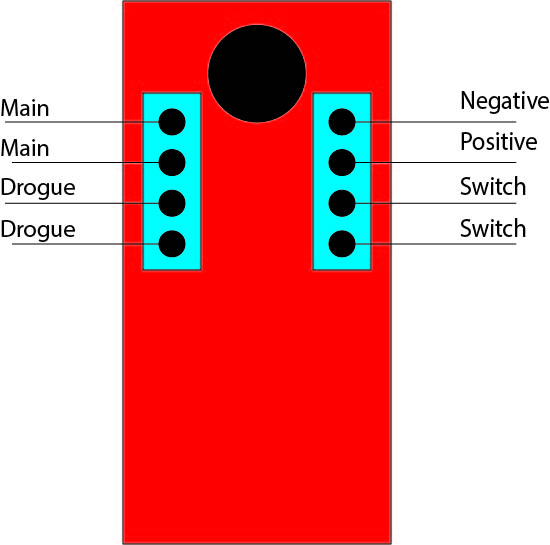

# \[in progress\] Altimeters

Commercial off-shelf altimeters are often required and just nice to have for redundancy. We use the perfect flite stratologger. 

## Programming

\(to be continued\)

## Wiring

Positive and negative does not matter for main and drogue as both sides go to an E-match. Same with switch, both sides are the same. However, make sure that the positive and negative sides of the battery is connected properly and listen to beeps for accuracy.

