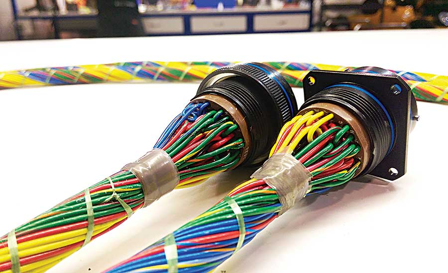

# Wire Design and Routing

## IREC Requirements

IREC has some requirements for safety critical wires. This is defined as wiring associated with drogue \(or other drag device\) deployment, main parachute deployment, and any air-start rocket motors. These requirements are summarized as follows:

* “Individual wires should be bundled together to make a harness”
  * Twisted together
  * Zip Ties every 5 cm
  * Mesh sleeving \( should allow for inspection of wiring inside\)
* Harness supported by plastic P-clamps
* All connected items by the harness should be rigidly fixed and cannot move
* Allow some slack in the wire

### General Wiring Suggestions

Wires should allow for some slack but avoid excess length when possible. Dedicated wire support can be mounted on the walls so wires can be run-through them conserving space. Wires can also be labeled so that they can easily be distinguished in a timely manner.

IREC wiring requirements and suggestions can be referenced starting at page 23 here:



