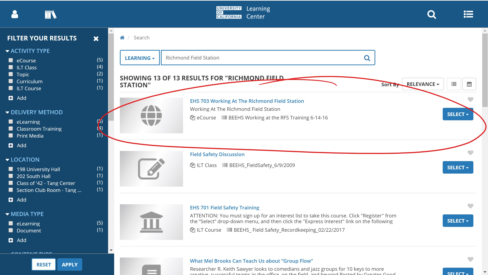

# RFS Safety Training


All leads will strictly enforce this requirement. You will not be allowed to go to the RFS if you have not completed the training **AND** followed all the steps below to submit proof of completion.


## Starting the Online Training Module

Information about the training requirements can be found at the following website, under the section title "Working at the RFS Training Module". Detailed instructions from the page will also be listed below.



1. Go to this link, you will be prompted to login with your Calnet identity: [https://jwas.ehs.berkeley.edu/lmsi?deepLinkActivityId=247519](https://jwas.ehs.berkeley.edu/lmsi?deepLinkActivityId=247519) 
2. If the link above does not immediately work, try this link: [https://jwas.ehs.berkeley.edu/lmsi](https://jwas.ehs.berkeley.edu/lmsi)
3. At the UC Learning Center welcome page, navigate to the correct training course by searching for "Richmond Field Station" and selecting the course "EHS 703 Working at the Richmond Field Station".  
4. Start the training, if you are prompted for Organization, enter "STAR", or if you are prompted for a Faculty Adviser, "Ömer Savaş".

1. After completing the training, you should have a completion certificate. Take a screenshot of it [\(instructions to take a screenshot\)](https://en.wikipedia.org/wiki/Screenshot), or save it as a PDF. 


You have finished the training BUT you are not done yet. **You must submit proof of completion using the following form:** 





You have now completed the RFS safety training requirement!


