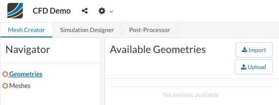
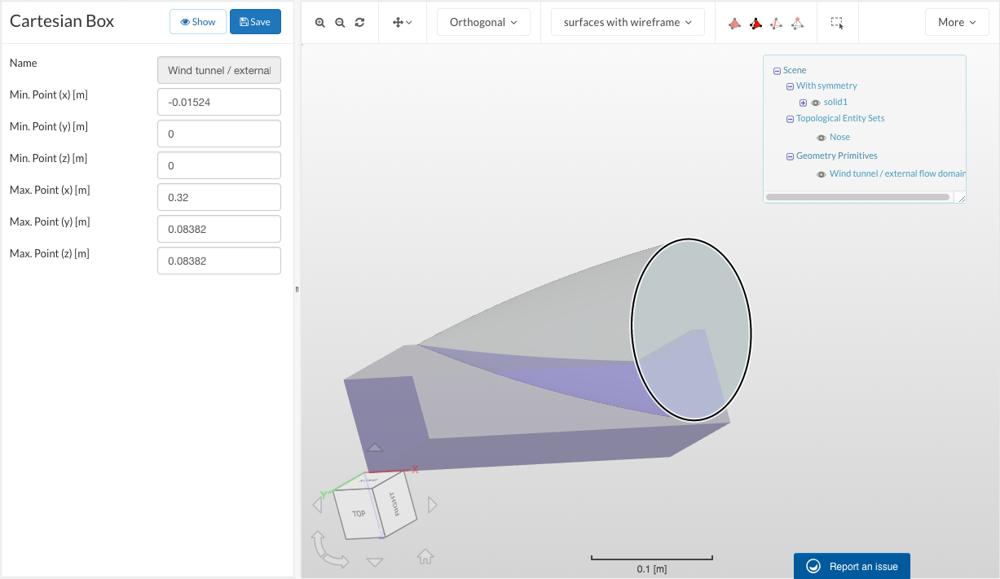
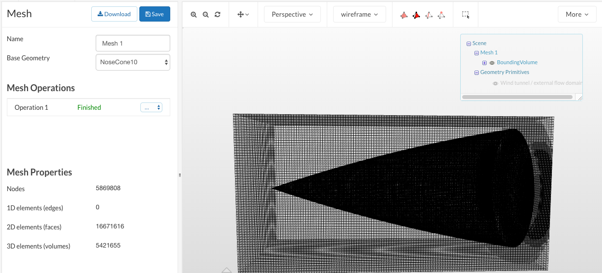
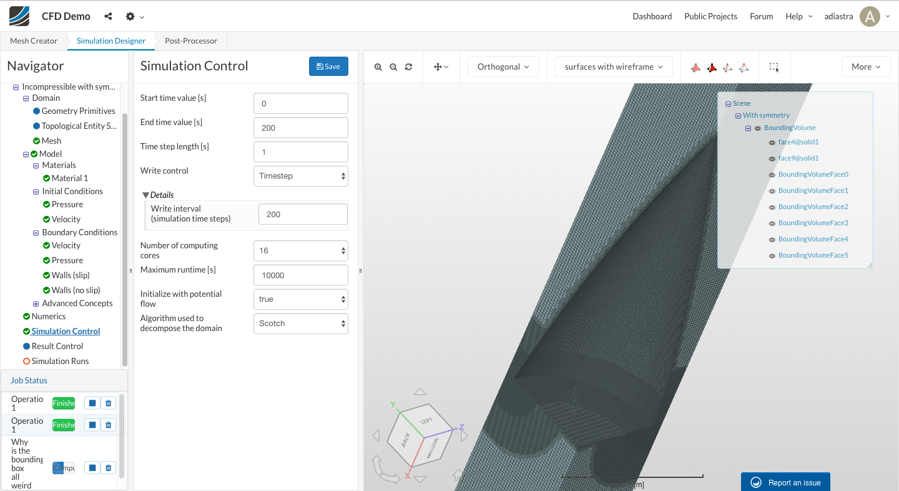
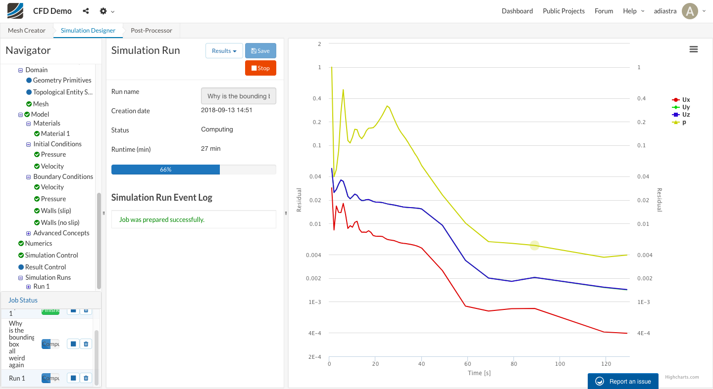
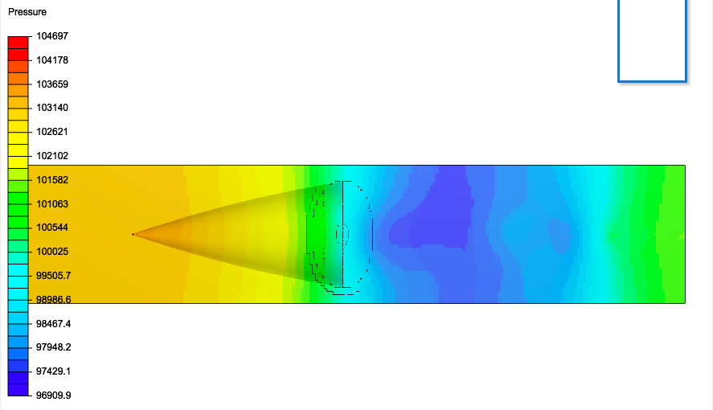

# SimScale 3D CFD

 The SimScale interface steps are mostly self-explanatory, but there are some subtleties to running a simulation that won't be apparent from just clicking through. Most of these will carry over to ANSYS, so it's definitely useful to gain experience on this easier platform!

### Mesh Creator

At the start, this is what you'll see. Upload geometry \(which can be Solidworks, STL, parasolid, etc.\), and you'll see the model on the right side. At this point, depending on the model, it might help to define a "topological entity set" \(a set of faces on which the same operation can be defined\). The model being used for this demonstration isn't too complicated, but with more intricate models like full rockets, it will help to define these.

Now, click on "Meshes", and assign the model you just uploaded as base geometry, then save. You can now start a mesh operation. You'll see multiple types of meshes you can make:

* Tet-dominant
* Hex-dominant automatic
* Hex-dominant parametric
* Hex-dominant automatic "wind-tunnel/external flow"
* Hex-dominant \(beta preview\)

You can hover over each of these for an explanation. To estimate drag using CFD, hex-dominant automatic "wind-tunnel/external flow" is a good option if specific control is not required, and hex-dominant parametric allows for additional customization. Apart from the beta preview, all the hex-dominant modes are exclusively for CFD; SimScale will throw an error if you set up an FEA simulation using one of these meshes.

Fineness is on a scale of 1-5; usually, any setting greater than 3 risks timing out \(but not always\). "Inflate boundary layer" should be left on if turbulent flow is being simulated. The number of computing cores can be set to a maximum of 16 on the free version. It's important in the meshing stage to set the wind tunnel dimensions; by default, it will only be big enough to include the geometry and will not give space for the airflow. The dimensions of the wind tunnel box should be adjusted on the axis along which the geometry has axial symmetry.

Although symmetry boundary conditions can be set in the simulation designer, it is also possible to reduce effort at the meshing stage due to symmetry. This can be done by adjusting the bounding box as well. For rockets, this will usually include only one of the fins. In this case, a 2D simulation would also suffice \(of just a small slice of surface area, which can be extrapolated around the whole 3D surface due to radial symmetry\) but for the demonstration, 1/4 of the object will be taken.

After a while, the mesh will finish \(you can read the Meshing Log to see how far along it is, while you're waiting!\) and you'll see something like this:

Note that here the wind tunnel is hidden. You can make it visible in the tree to the top-right, but making it visible usually makes the viewer look weird.

### Simulation Designer

Once you've got a finished mesh, you can move to the Simulation Designer. Click on "Simulations", then "New" and select Incompressible or Compressible \(for this case, Incompressible, but if the speed of the flow is greater than Mach 0.3 it should be Compressible\). The turbulence model can be set to Laminar if turbulent effects are not desired \(if you didn't select "Inflate boundary layer" in the mesh designer\). The difference turbulence models will be tested and written about in a future update.

Select the mesh you just made as the Domain, and add Air \(from the material library\) as the material for the bounding box, unless you're making a submarine. Set 1atm \(101325 Pa\) as the initial condition.

The most important part of this setup is the boundary conditions; a simulation is almost completely determined by its governing equations \(set by the simulation mode, such as CFD incompressible\), its geometry \(set by the mesh\) and the boundary conditions, so it's important to set these correctly. Boundary conditions have to be set for every face \(which is why it's useful to have topological entity sets, from the mesh creator\); if in doubt, set any surface's boundary condition to "Wall -&gt; Slip" \(not no slip, which is the default, if it's part of the mesh as opposed to part of the boundary\). Adding a symmetry boundary condition along the faces with axial symmetry will make computation easier. 

The essential boundary conditions to add are a velocity inlet at the front of the wind tunnel box \(the velocity can be set as a constant, or as a function of any of x, y, z, t\) and a pressure outlet at the back along the axis of symmetry. You can set the velocity based on whatever seems reasonable, and the pressure outlet should also be at 1atm.

\(This mesh should actually be a bit wider on the sides, will update when I can\)

The last set of relevant parameters is under Simulation Control. For a steady-state simulation \(time-independent\), the specific time values do not matter, but the \(end time value - start time value\)/time step length is the number of iterations that will be run. SimScale caps the maximum runtime so that you don't run through all your core hours doing way too many iterations of one simulation, but you can adjust this so that more iterations can be run. The default is 1000 iterations; it's 200 here for the sake of runtime, although the quality may be reduced because of this.

To see the quality of results, SimScale will provide a convergence plot, which is a graph of different parameters in the simulation. The closer to flat this graph gets, the better.

The runtime bar is slightly nonlinear; it may not make any progress for the first 15 minutes. That's okay! If it increases to 0.1% after that and doesn't move for another 15 minutes, that may not be okay; consider redoing your setup at that point. You can also read the solver log if you're curious about what it's doing.

SimScale will send you an email once your simulation is done, so you can check the results using the post-processor or download them.

### Post-Processor

In the post-processor, select "Results" then the variable to be shown. \(Haven't really looked into this too much yet but here's what you'll get - to be updated later\).

