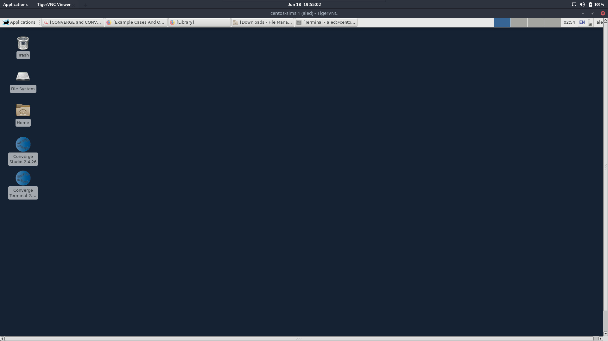

# Getting Started with CONVERGE \(2.4\)

## Getting Access to CONVERGE

At the time of writing CONVERGE is hosted on a server administered by Aled Cuda, the current Sims Lead. In order to access converge you must contact him for the information necessary to VNC into said server. Although it is possible to install converge on your computer, this can be a highly involved process, and I guarantee you this server is plenty powerful.

When you receive your username you will receive a message that looks like this


Example, actual parameters may differ


```
username: bobby
password: fishcat123
vncport: 5901
```

Using these values and the vnc client of your choice vnc to gw.ld-cd.net, you should be greeted with a desktop like this:



Center right you can see the icons for converge studio, and a terminal appropriately configured for use with converge.

## Running a case in parallel

Although converge does support running jobs in serial from converge studio, any reasonable job will take ridiculous amounts of time to execute. In order to execute a job in parallel, open a converge terminal and do the following:

```bash
cd ~/MYCASEDIRECTORY
mpiexec -n 24 converge-2.4.26-mpich super
```

The server has two Intel X5690 processors for a total of 12 physical and 24 logical cores, so adjust the number of jobs \(-n 24\) as you see fit.

