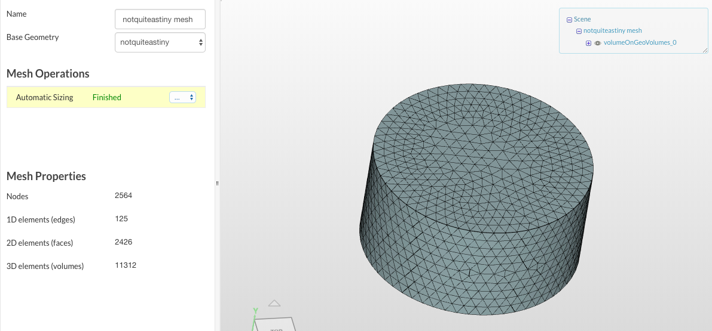
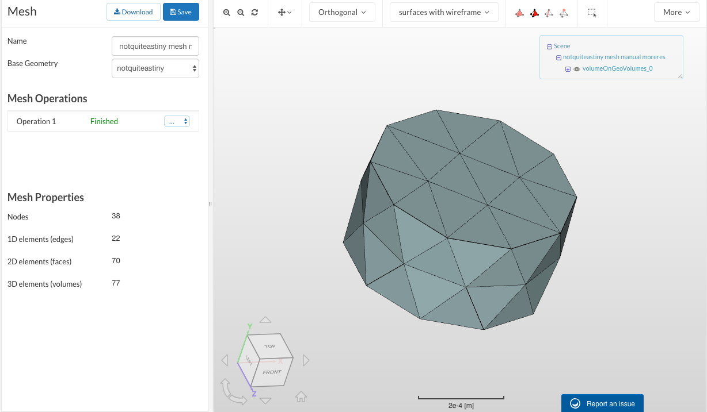

# Mathematical Models

## Simulation Steps 

The steps involved in designing and running a simulation are as follows:

1. Translate a physical problem to a mathematical model
2. Go through some procedure to find a numerical solution
3. Post-processing \(such as interpolation\) to generate output
4. Compare output to back-of-the-envelope estimate and/or experimental data

Not all of these have to be done manually, and simulation interfaces such as ANSYS will not show that all of this is happening. But users should be aware that this is what the program is doing, as well as roughly what the mathematical model consists of for each major mode of analysis \(CFD, FEA and so on\).

### Translation to a Mathematical Model

This step essentially converts the physical problem \(e.g. calculating a certain quantity, such as stress at a set of points due to some load, or drag force due to some specified airflow model\) to the mathematical problem of solving a differential equation for each of those points. Completely solving these differential equations can be difficult or impossible in practice, but fortunately, making accurate numerical estimates at specific points is computationally possible. A future update will explain how this process works; for now, check out the example in week 1 of the Cornell EdX class, "A Hands-On Guide to Engineering Simulations", for an explanation. 

### Meshing

Solving a differential equation for a continuous body is impossible in general, given both the potential complexity of the equations \(look at the Navier-Stokes equations for an example\) and the arbitrary nature of the input geometry. Meshing is a process by which the arbitrary continuous input geometry is discretized. This means any valid CAD model can be converted to a mesh: a set of nodes with edges connecting them. Solving the equations for each of these nodes then makes the problem doable, and for a large enough mesh the difference between the exact solution and the discretized version is negligible. 

Meshes work by representing each surface as a network of polygons, usually of 4 to 6 sides \(but the examples shown use triangles\). Here's an example of a mesh you might work with:

And here's an example of a mesh you almost definitely won't work with, but that shows how the procedure functions more clearly:

The simplest \(but potentially less accurate\) mesh generation uses triangles as the basic unit. This is simple because polygons of N sides can always be converted to triangles by connecting non-collinear sets of three points repeatedly \(image\)

This is a valid mesh, but not a very good one. All the triangles are long and thin, so nodes connected by a long edge may interpolate where doing so would not be accurate. \(Linear approximations work well on small scales, but not on larger ones\). 

To solve this, we can introduce new nodes in the center of the shape. In order to avoid long and thin mesh elements that do not provide an accurate approximation, a minimum angle is set: all angles in each mesh surface element must exceed some threshold for quality \(I've seen 20.9 degrees but citation needed\). When an angle is lower than this threshold, the edges causing this small angle are replaced by edges  with admissible angles. 

The Delaunay algorithm \(link\) describes how to do this. Ruppert's algorithm is similar, with the introduction of the midpoint of each triangle. Its time complexity is greater, which may or may not be worth the extra accuracy depending on the case. 

## Boundary Conditions



Boundary conditions are how you specify what happens to an object \(as represented by a mesh\). Since the underlying geometry does not contain information about the environment in which the part exists, we apply boundary conditions to simulate the external environment, such as airflow or an applied force. 

