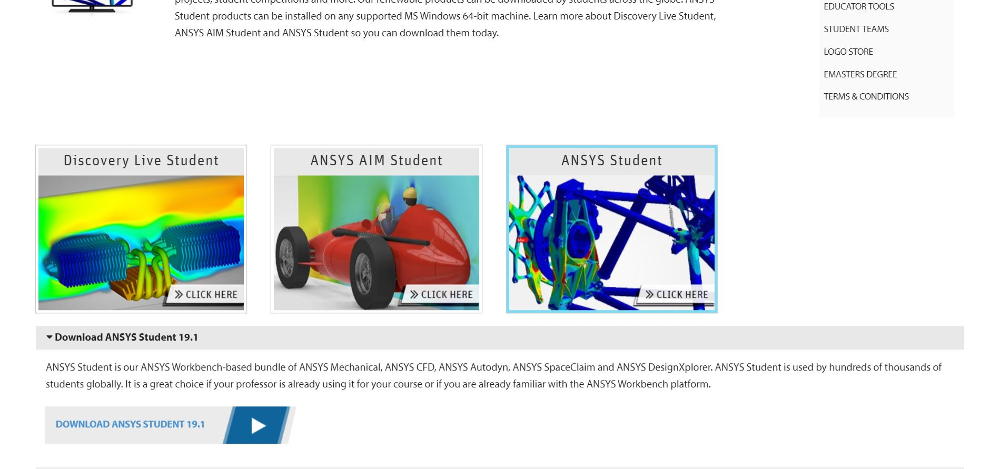

# ANSYS Installation and Setup

## Downloading ANSYS

To download ANSYS Student, navigate to [https://www.ansys.com/academic/free-student-products](https://www.ansys.com/academic/free-student-products). Scroll down and select ANSYS Student, then click on the Download ANSYS Student 19.1 button that appears below.

## Installing ANSYS

After the folder finishes downloading, unzip it with your favorite unzipping tool and navigate to the new folder.  Then, open a file found inside the new folder labeled Setup.exe.  Click the Next arrow in the bottom right corner as you progress through the setup.  Once installed, you can open ANSYS by searching "Workbench 19.1" in your computer's start menu.

## Known Issues

We have experienced an issue once where the workbench application did not install.  In this case, delete the ANSYS program file in your C drive and repeat the process above.

