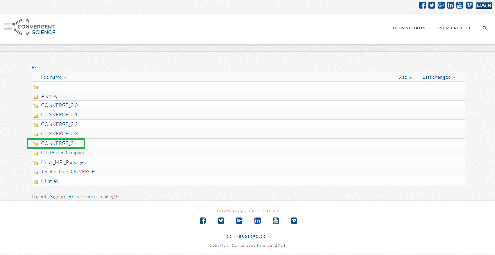
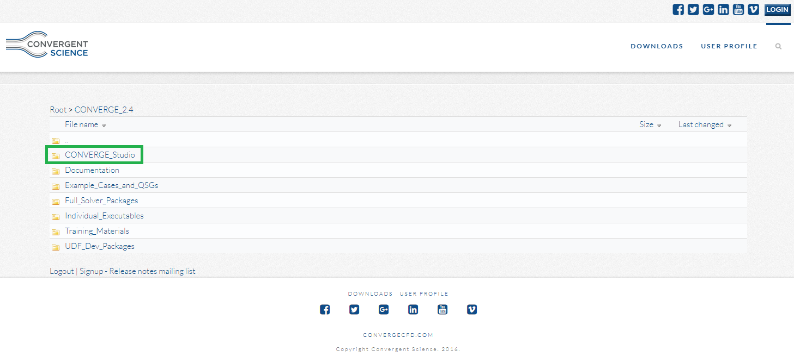
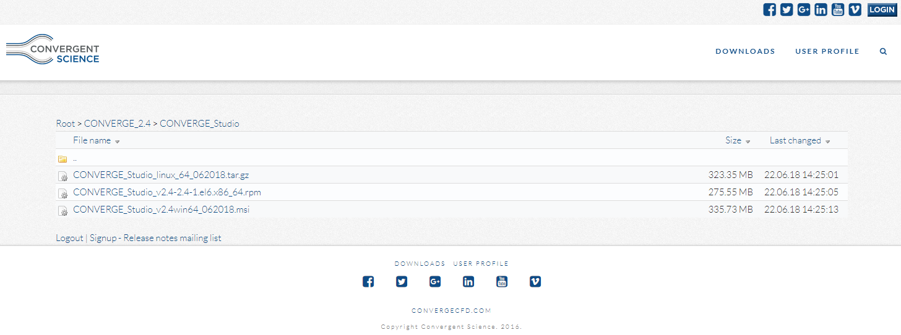

# \[deprecated\] Installing and Licensing Converge CFD

## Deprecation Notes

Refer to deprecation note in [\[deprecated\] Connecting to CalSTAR's Server](connecting-to-calstars-server.md).

## About

Converge CFD is a particle-based fluid dynamics solver. It is currently being evaluated by the Simulations team for full team usage. [More details about the software can be found here.](https://convergecfd.com/)

There are actually two programs relevant here: CONVERGE and CONVERGE STUDIO. Both are included in our license. CONVERGE is basically the actual solver. CONVERGE is the program that will run your processed input files and return the simulation. CONVERGE STUDIO is a pre-processor where you can view geometries, set boundaries, set simulation options, and export these as input files for CONVERGE. CONVERGE STUDIO is also capable of running CONVERGE in serial, and validating the exported inputs with CONVERGE.

## Converge Studio

### Downloading

[Click here for Converge CFD's Downloads page.](https://download.convergecfd.com/) You will need to make a new account, or log in with your preexisting account. Upon logging in, a file directory page will be shown.

Select **CONVERGE\_2.4**, then **CONVERGE\_Studio**, then download the appropriate file for your operating system. 







### Installation

There are no special instructions for installation. Simply run your downloaded file and follow the on-screen prompts. 


It will be helpful to make a note of your installation directory, as you will need it for licensing.


### Licensing

#### License File

Since the software is no longer in use, and the license file has been requested multiple times by persons clearly not on the team, the license file is now unlisted and private. Please contact your current leads if you really must use the license file.


The license file can only be downloaded when signed into Google Drive with a berkeley.edu account.


Copy or move the 'license.lic' file into the license folder in CONVERGE Studio's installation directory. For Windows, the default location is

```text
C:\Program Files\CONVERGE Studio\v2.4\license
```


The file MUST be named license.lic or CONVERGE Studio will be unable to locate the file.


#### Connecting to the License Server

The license for Converge CFD is a floating license. This means you must be connected to a licensing server in order to use the software. For CalSTAR, the licensing server is our only server, the PDM server. [For instructions on connecting to the server, click here.](https://calstar.gitbook.io/docs/tutorials/software/connecting-to-calstars-server)

Once the license.lic file is copied into the correct directory, and you are connected to the server, simply launch CONVERGE Studio. 


You must stay connected to the server while working in CONVERGE Studio. The program will perform a license check out/verification every few hours. **This includes simulations. You must be connected during a simulation or it will be terminated after the next license check.** Terminated sims can be restarted via the restart file.



For floating licenses, **only 5 simulations can run at a time across ALL computers**. Please make sure with the Simulations Lead that no other critical sims are running before you start yours.



