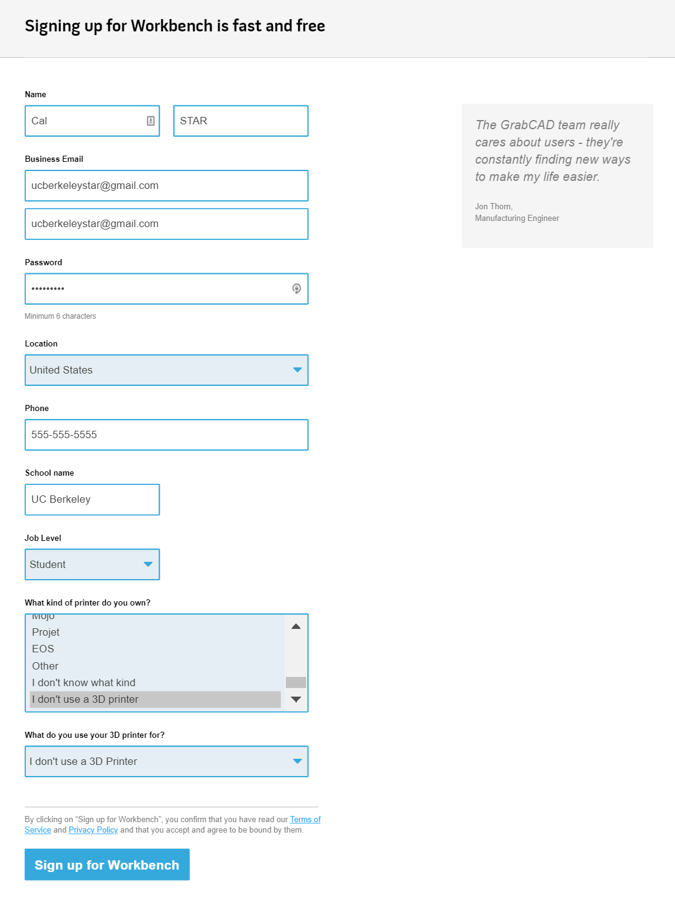

# \[deprecated] Getting Started With GrabCAD Workbench

## 0. What is GrabCAD Workbench?

GrabCAD Workbench is an online platform to share CAD files and collaborate on projects, featuring version history tracking. It integrates directly with SolidWorks with a toolbar add-in and a desktop application.

## 1. Creating a GrabCAD Account

If you already have a GrabCAD account, you can skip this step.


GrabCAD Community and GrabCAD Workbench accounts are the same


Creating a GrabCAD account is a straightforward process, first naviagte to:


Link to create a GrabCAD account


In the company details section, choose job level as "Student" first before filling anything else out. The company name section should change to school name; type "University of California, Berkeley" (or some variation thereof) in the text box.

Proceed through the signup process.

Be sure to go to your email to confirm the account.


You've now successfully created a GrabCAD account!


## 2. Getting added to STAR on GrabCAD Workbench

STAR parts currently follow the set naming convention outlined at [https://rocketry.gitbook.io/public/tutorials/documentation/solidworks-file-conventions](https://rocketry.gitbook.io/public/tutorials/documentation/solidworks-file-conventions) found under Tutorials --> Operations --> SolidWorks file conventions. **All parts in STAR GrabCAD projects created after 2019 must follow this format.** If you have questions, just ask in #operations!

**Message the email you used to sign up for GrabCAD to the Operations Lead (@mcelly#1609) along with a copy of the previous paragraph on naming to obtain an invitation to STAR's GrabCAD page.** Let them know which projects you need access to, if possible.

## 3. Downloading the GrabCAD desktop application

The GrabCAD Workbench desktop application allows you to sync CAD files from your projects so that you have a local copy on your computer. It also installs the companion SolidWorks toolbar.

Navigate to the following link to download the installer:


GrabCAD Workbench desktop app installer


Continue through the installation process. After completing the installation, be sure to log in with your GrabCAD account.


You've now successfully installed the GrabCAD Workbench desktop application!


## 4. Next steps

You may want to unsubscribe from Workbench emails here (there are a lot!): [https://workbench.grabcad.com/account/workbench\_notifications](https://workbench.grabcad.com/account/workbench\_notifications)


[using-grabcad-workbench-in-solidworks.md](using-grabcad-workbench-in-solidworks.md)



[how-to-use-solidworks-templates.md](../general-tutorials/how-to-use-solidworks-templates.md)

