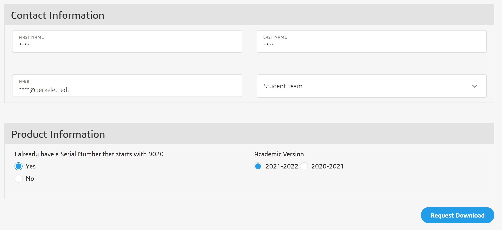

# SolidWorks Installation

## Installation


SolidWorks is only available for Windows 7, 8, and 10. If you have a UNIX-based operating system, consider dual-booting Windows \(see [Boot Camp](https://support.apple.com/en-us/HT201468) for macOS\) or running a virtual machine \(the campus provides VMware and a Windows license for free, but you can also use Parallels for macOS or VirtualBox for Linux\). Refer to the VMware/Boot Camp setup page for more detailed instructions



Before starting, make sure you have a fast, reliable internet connection and enough space on your disk. This process will download roughly 8GB of data.


### SolidWorks Student Design Kit \(SDK\)

SolidWorks SDK is a free version that includes SolidWorks Standard. If you need fluid simulation capability or any feature of SolidWorks Premium, contact a lead for a SolidWorks Engineering Kit \(SEK\) license. A comparison matrix can be found [here](https://www.solidworks.com/sw/docs/Student_Access_Product_Matrix_LB.pdf); 98% of STAR users are currently using SDK and all production CAD must adhere to the SDK feature set unless an exception is requested.


STAR is upgrading to SolidWorks **2019**! You may have multiple versions of SolidWorks installed, but please use SolidWorks 2019 \(also called **2019-2020**\) for all STAR work. Note that installation is _smoothest_ if you uninstall all other versions of SolidWorks before starting; post in \#operations if you encounter issues.


To download SolidWorks SDK, navigate to [http://www.solidworks.com/sw/education/SDL\_form.html](http://www.solidworks.com/sw/education/SDL_form.html). Mark "No" that you do not have a serial number and then enter "**9SDK2019**". Select the desired version from the dropdown. Fill out your email and select "Student Team" from the dropdown.

SolidWorks will now send you an email with a serial number and download instructions. You will also be redirected to the download page in your browser, where the same serial number will be displayed. When ready, click the download button and follow the instructions!


The download link only downloads a ~28.2MB file named SolidWorksSetup.exe. The 8GB download will take place after following the instructions in the installer.



You should now have successfully installed SolidWorks! If you encounter issues, please contact a lead before moving on. Uninstalling, rebooting, and trying again can resolve many issues.


### SolidWorks Student Edition \(2021-2022\)

STAR is migrating to the SolidWorks 2021 Student Edition.

* Go to: [www.solidworks.com/SEK](http://www.solidworks.com/SEK) and complete the form \(first name, last name, Berkeley email address, select “student team” on dropdown\)
* Under product information
  * Select Yes \( I already have a serial number\)
  * Choose **2021-2022** version


Contact the operations lead for the serial number



The download link only downloads a ~32.1MB file named SolidWorksSetup.exe. A 7.1GB-18GB download will take place after following the instructions in the installer. 


On the summary page of the installer, you can select which products you wish to install to save space. At minimum, you will need the 7.1GB SolidWorks package.

Instructions on downloading and installing SolidWorks Student Edition 2021 can also be found [**here**](https://files.solidworks.com/education/EDU_SW_SEK_Installation_Guide_ENG_2021.pdf).


You should now have successfully installed SolidWorks! If you encounter issues, please contact a lead before moving on. Uninstalling, rebooting, and trying again can resolve many issues.


