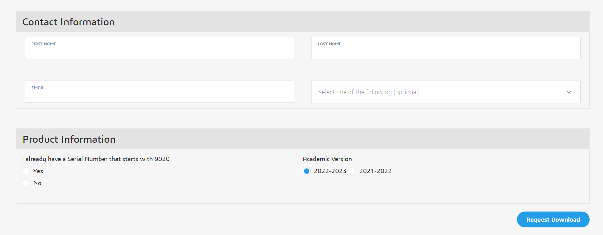

# SolidWorks Installation

## Installation


SolidWorks is only available for Windows 7, 8, and 10.&#x20;

* If you have a UNIX-based operating system on an Intel/AMD chip, consider dual-booting Windows (see [Boot Camp](https://support.apple.com/en-us/HT201468) for macOS) or running a virtual machine (the campus provides VMware and a Windows license for free).
  * You can also use Parallels for macOS or VirtualBox for Linux. Refer to the VMware/Boot Camp setup page for more detailed instructions.
* If you have a [Mac with an M1 Silicon processor](https://support.apple.com/en-us/HT211814), you must use Parallels for macOS as Boot Camp is unsupported on these Macs.
  * You can also attempt to use other means to access a Windows installation like Chrome Remote Desktop.



Before starting, make sure you have a fast, reliable internet connection and enough space on your disk. This process will download roughly 8GB of data.



If you are upgrading from an older version of SolidWorks, do not delete the old version and then download the new version. The old version can be upgraded.


### SolidWorks Student Edition (2022-2023)

STAR is migrating to the SolidWorks 2023 Student Edition.

* Go to: [www.solidworks.com/SEK](http://www.solidworks.com/SEK) and complete the form (first name, last name, Berkeley email address, select “student team” on dropdown)
* Under product information
  * Select Yes (I already have a serial number)
  * Choose **2022-2023** version


Contact the operations lead for the serial number.


<figure><figcaption></figcaption></figure>


The download link only downloads a \~32.1MB file named SolidWorksSetup.exe. A 7.1GB-18GB download will take place after following the instructions in the installer if a new installation is made.&#x20;



Make sure you only install Solidworks, and not any of its extra add-ons like Solidworks Electrical. People have had problems in the past when trying to install extra add-ons.


If presented with the option above in the installer, it is recommended to upgrade rather than create a new installation to save space.

On the summary page of the installer, you can select which products you wish to install. At minimum, you will need the 7.1GB SolidWorks package.

Instructions on downloading and installing SolidWorks Student Edition 2023 can also be found [**here**](https://files.solidworks.com/education/EDU\_SW\_SEK\_Installation\_Guide\_ENG\_2021.pdf).


You should now have successfully installed SolidWorks! If you encounter issues, please contact a lead before moving on. Uninstalling, rebooting, and trying again can resolve many issues.

