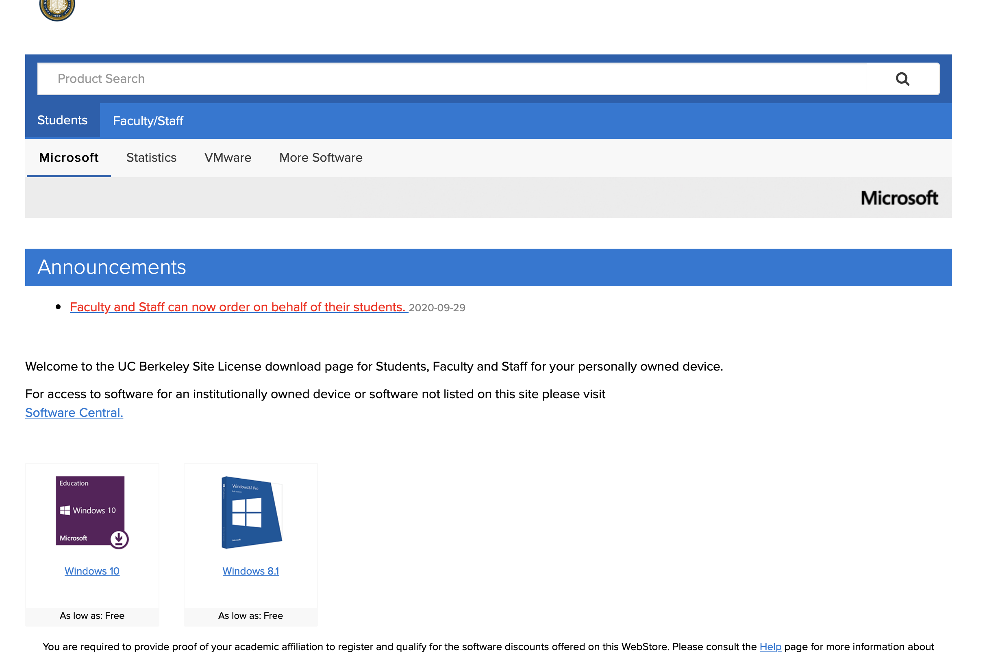
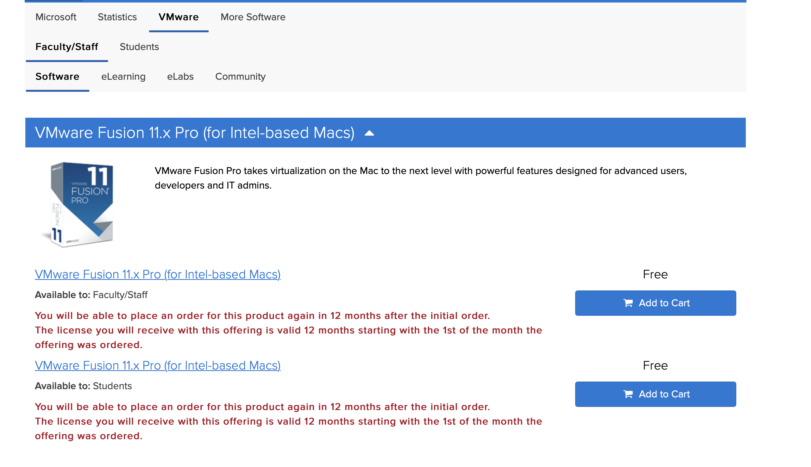
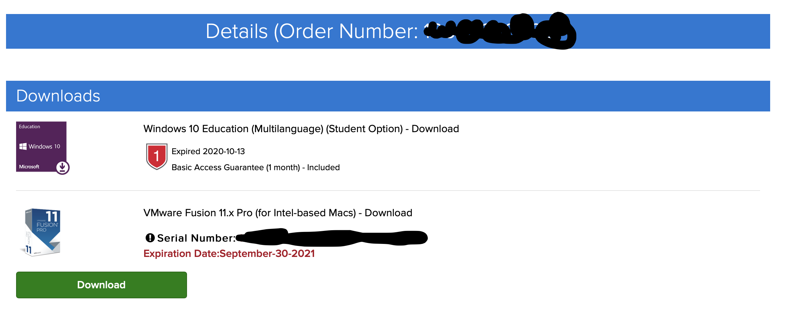
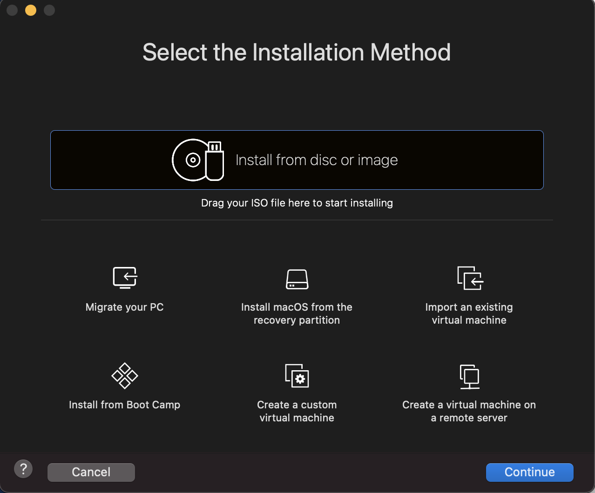
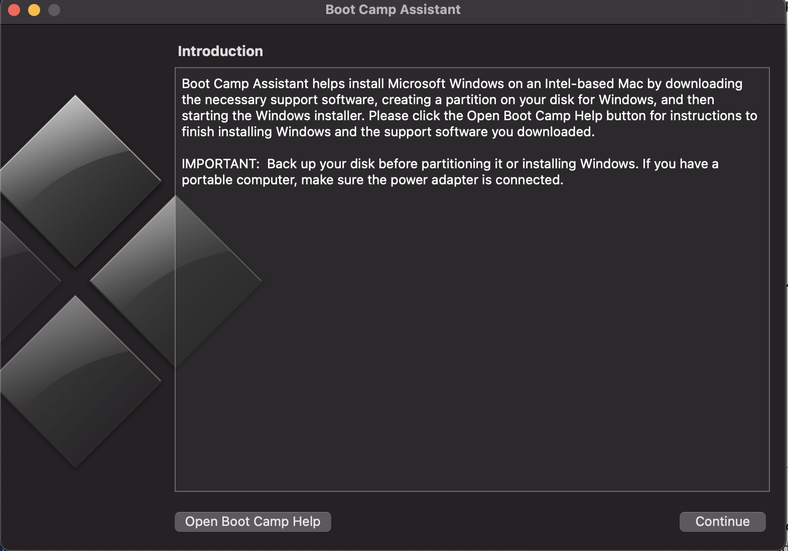

# VMware/Boot Camp setup


Do this BEFORE any part of the solidworks tutorial if you do not have a windows operating system



If you've already downloaded SolidWorks onto your mac, just delete it until after you have completed this tutorial.


VMware is a software that is free for Berkeley students that allows you to run windows on a non-windows computer which will allow you to install and run SolidWorks. Bootcamp is a program native \(already downloaded\) on macs that also allows you to run windows on a mac. Both options have some pros and cons which will briefly be detailed below. If you already know what you want to use, skip to the directions. If you have any questions/problems with the directions feel free to contact Ananya Subramani on the STAR Discord.

## VMware and Boot Camp Similarities

* Allow you to run the latest version of Windows
* Can run SolidWorks

## VMware and Boot Camp Differences

* VMware is easier to start up \(like starting up a browser or generally opening up an app\)
* Boot Camp requires you to restart your computer whenever you want to run in a windows environment
* Boot Camp requires you to permanently partition your hard drive which cannot easily be changed after it is done.
  * Partitioning your hard drive here means that some amount of your drive will only be accesible to the windows boot and the rest will be accesible normally
  * Main thing here is that you can't get more memory/storage if you need it in the windows portion easily
* VMware does not require a permanent partition so the size can change
* Boot Camp will run SolidWorks more smoothly because all of your RAM can be used
* VMware will be able to run solidworks, but it may not be as smooth because you won't be utilizing all of your RAM

My personal reccomendation is to use Boot Camp if you plan to use solidworks very actively, and VMware if you just want to look at files in more detail than grabcad shows. If you have a lot of RAM though, you could probably just go with VMware and be fine

## How do I get Boot Camp/VMware to work?

#### Step 0- System Pre-requisites

You will need the following things, or the download will probably fail at some point:

* Mac made in 2011 or later
  * exception: 2012 Mac Pro “Quad Core” using the Intel® Xeon® W3565 Processor
* OS X 10.11 El Capitan minimum required
  * You can check this using the "About your Mac" tab in the top left corner apple drop down menu
* &gt;50 GB free storage

#### Step 2- Get a Windows License

Start by going to this website: [https://software.berkeley.edu/microsoft-operating-system](https://software.berkeley.edu/microsoft-operating-system) and taking the link for "personally owned devices." You should be able to navigate to this screen:

Click on Windows 10 and add it to your cart. If you want to use VMware, go to step 2.5, if you want to use Boot Camp, check out and go to step 3.

#### Step 2.5- Get VMware

From the same place you should be in step 2, go to the VMware tab and download VMware Fusion 11.x \(for Intel-based Macs\). You should get to this screen:

Add VMware to your cart and check out.

#### Step 3- Download Windows Operating System Disk Image

In the details of your purchase that you made in step 2, there should be a windows license number, you will need that.

My screenshot doesn't have a Windows license number because it's been more than one month since I "bought" it but yours should.

Once you have access to that license, navigate to this site: [https://www.microsoft.com/en-us/software-download/vlacademicwindows10iso](https://www.microsoft.com/en-us/software-download/vlacademicwindows10iso) 

Select the proper language, and download the 64-bit version

VMware users, go to step 4, Boot Camp users go to step 5

#### Step 4- Setting up VMware

Download VMware fusion from the cart and open and install the application. When it asks for a number during the setup process, enter the serial number that I blacked out in my screenshot.

Once you see this screen, drag the windows 10 iso file into the place where it says install from disc/image \(the default name for the downloaded file is shown below\)

From here, just go through the installation steps and once you have your virtual machine configured and you can access the internet, go back to the solidworks installation guide and follow those steps \*in\* your virtual machine.

#### Step 5-Setting up Boot Camp

Using the spotlight search or some other search bar on your mac look up "Boot Camp Assistant" and open the app. You should see the following screen.

From here, hit continue and you should be able to choose your partition size, with the minimum being 42 GB, which should be fine, but if you are willing to dedicate more space to a Windows partition, go for it.

Once you've completed the installation process, you can boot into your windows partition by restarting your mac while pressing the "option" key.

Once you are in your Windows partition, you can go back to the SolidWorks installation guide and download SolidWorks.

